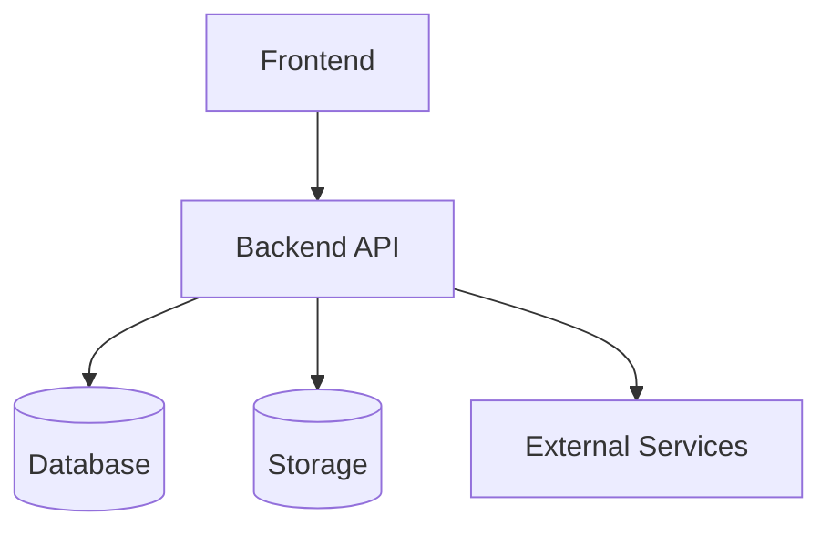
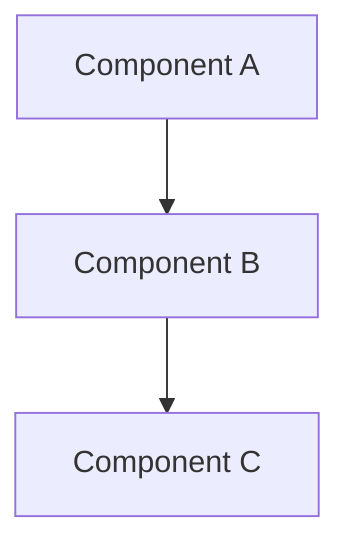

# Codebase Documentation Generator

## Overview

You are generating structured project documentation for a codebase. Scan the codebase systematically and produce documentation in the standard `docs/` structure. The output should give any developer — including one who has never seen this project — a complete understanding of the system's architecture, components, data flow, and dependencies.

This prompt can also be run across multiple related codebases to produce cross-project analysis and consolidation recommendations.

## Documentation Structure

All output follows this standard directory layout:

```
docs/
├── architecture/                  # System design and structure
│   ├── overview.md                # High-level architecture, tech stack, system boundaries
│   ├── components.md              # Component inventory with responsibilities
│   ├── data-flow.md               # How data moves through the system
│   ├── dependencies.md            # External services, libraries, infrastructure
│   └── {topic}.md                 # Additional architecture docs as needed
├── reference/                     # Research-backed domain knowledge (see PROVEN principles below)
├── guides/                        # How-to instructions (not generated by this prompt)
└── plans/                         # Project plans (not generated by this prompt)
```

This prompt generates the `docs/architecture/` directory. Reference docs, guides, and plans are authored separately.

---

## Phase 1: Scan the Codebase

### Step 1: Map the Structure

Read configuration files, package manifests, entry points, and directory layout to determine:

- Frontend framework and version
- Backend framework and version
- Database(s) and ORM/query layer
- Object storage (S3, GCS, etc.)
- AI/ML services and models (if any)
- Infrastructure (Lambda, Docker, Kubernetes, etc.)
- External service integrations
- Authentication approach
- Build tools and CI/CD

### Step 2: Inventory Components

Identify every distinct component — a cohesive unit of functionality (route file, service module, Lambda function, React page, utility library, etc.).

For each component, record:

| Field | Description |
|-------|-------------|
| Name | Descriptive name |
| Location | Directory/file path(s) |
| Files | Count of source files |
| Lines | Approximate LOC |
| Responsibility | What this component does |
| Dependencies | What it depends on |
| Dependents | What depends on it |

### Step 3: Trace Data Flow

Map the major data flows through the system:

1. Identify every entry point (user input, webhooks, cron, queue consumers)
2. Trace each flow through processing, storage, and exit points
3. Note transformation points where data changes format
4. Identify external service calls and their purpose

### Step 4: Catalogue Configuration

- What is hardcoded vs configurable?
- Where do configs live (env vars, config files, database)?
- How are environment-specific configs handled (dev/staging/prod)?
- Are there feature flags?

### Step 5: Assess Test Coverage

- Do test files exist? Where?
- What testing frameworks are used?
- Approximate coverage level (or absence)
- Are there CI checks?

---

## Phase 2: Generate Architecture Documentation

### `docs/architecture/overview.md`

```markdown
---
title: Architecture Overview
created: {date}
updated: {date}
status: current
tags: [architecture, overview]
---

# Architecture Overview

## System Purpose

{What this system does, who uses it, and why it exists. 2-3 sentences.}

## Tech Stack

| Layer | Technology | Version |
|-------|------------|---------|
| Frontend | | |
| Backend | | |
| Database | | |
| Storage | | |
| AI/ML | | |
| Infrastructure | | |

## Architecture Style

{e.g., Three-tier web app, microservices, serverless pipeline, monolith. Describe the overall pattern.}

## System Diagram

{Mermaid flowchart showing the major system components and how they connect.}



## System Boundaries

{What is inside the system vs external. What does it own vs depend on.}

## Key Design Decisions

{Non-obvious architectural choices and their rationale, if discoverable from the code.}

## Codebase Metrics

| Metric | Value |
|--------|-------|
| Primary Languages | |
| Source Files | |
| Approximate LOC | |
| Test Coverage | |
| External Dependencies | |

## Directory Structure

{Annotated directory tree showing the purpose of each major area.}
```

### `docs/architecture/components.md`

```markdown
---
title: Component Inventory
created: {date}
updated: {date}
status: current
tags: [architecture, components]
---

# Component Inventory

## Overview

{How many components, how they're organised, overall structure.}

## Components

### {Component Name}

**Location:** `path/to/directory/`
**Files:** {count} | **Lines:** ~{count}

{What this component does — 2-3 sentences.}

**Key files:**

| File | Purpose |
|------|---------|
| `file.ts` | {purpose} |

**Dependencies:** {what it imports/depends on}
**Dependents:** {what depends on it}

{Repeat for each component.}

## Component Dependency Graph



## Configuration Points

{Per-component: what is configurable and where config lives.}
```

### `docs/architecture/data-flow.md`

```markdown
---
title: Data Flow
created: {date}
updated: {date}
status: current
tags: [architecture, data-flow]
---

# Data Flow

## Overview

{How many major data flows, what categories they fall into.}

## {Flow Name}

{Mermaid sequence diagram or flowchart showing the complete path.}

**Entry point:** {where data enters}
**Processing:** {what happens to it}
**Storage:** {where it's persisted}
**Exit point:** {where it leaves the system}

**Key transformation points:**

| Stage | Location | Transform |
|-------|----------|-----------|
| {stage} | `file:line` | {input → output} |

{Repeat for each major flow.}
```

### `docs/architecture/dependencies.md`

```markdown
---
title: Dependencies
created: {date}
updated: {date}
status: current
tags: [architecture, dependencies]
---

# Dependencies

## External Services

| Service | Purpose | Integration Point |
|---------|---------|-------------------|
| {service} | {why it's used} | `file/path` |

## Key Libraries

| Library | Version | Purpose |
|---------|---------|---------|
| {library} | {version} | {why} |

## Infrastructure

| Resource | Type | Purpose |
|----------|------|---------|
| {resource} | {e.g., S3 bucket, RDS, Lambda} | {purpose} |

## Environment Variables

| Variable | Purpose | Required |
|----------|---------|----------|
| {VAR_NAME} | {what it configures} | {yes/no} |
```

---

## Phase 3: Cross-Project Analysis (Optional)

When documenting multiple related codebases, produce an additional analysis after all individual docs are generated.

### `docs/architecture/cross-project-analysis.md`

Analyse patterns across the documented codebases:

1. **Common patterns** — What's shared across projects (auth, database, API patterns, etc.)
2. **Duplication inventory** — Identical or near-identical code with LOC estimates
3. **Divergence points** — Where implementations differ and whether that's intentional
4. **Consolidation opportunities** — What could be extracted into shared packages, with effort/impact estimates
5. **Configuration variability** — What differs between projects that could be configuration-driven

### Consolidation Proposal (if applicable)

If significant duplication or consolidation opportunity exists, produce:

- **Executive pitch** — Business case: cost of duplication, ROI of consolidation
- **Technical proposal** — Target architecture, migration path, quick wins, risks

---

## Documentation Principles

### Obsidian Compatibility

- **YAML frontmatter** on every document (title, created, updated, status, tags)
- **Blank line before all tables** (rendering requirement)
- **Wiki-links** `[[path/to/doc]]` for cross-references between docs
- **Callouts** for emphasis: `> [!NOTE]`, `> [!WARNING]`, `> [!IMPORTANT]`, `> [!TIP]`
- **Mermaid diagrams** for system diagrams, data flows, dependency graphs

### Content Principles

- **Document what exists, not what should exist.** Architecture docs describe the current system. Recommendations for changes go in `docs/plans/`.
- **One topic per doc.** If a doc exceeds ~200 lines, split it. Cross-reference rather than duplicate.
- **Verify against the code.** Every claim in the docs should be traceable to actual source files. Include file paths.
- **Keep it current.** Architecture docs have a `status` field: `current`, `outdated`, `draft`. Mark docs that may drift from the code.

### PROVEN Principles (for `docs/reference/` only)

When generating research-backed reference documentation, apply:

- **P**rovenance — Every claim traces to a named, dated source
- **R**esearch-First — Document findings before writing code
- **O**ne Topic Per Doc — Split at ~200 lines
- **V**erifiable — Include sample size, population, effect size, journal name
- **E**vidence-Tiered — Label source quality (meta-analysis → RCT → observational → narrative → practitioner)
- **N**ot Duplicated — Single source of truth, update rather than create overlapping docs

---

## Success Criteria

The documentation is good if:

- A new developer can read `docs/architecture/overview.md` and understand the system in 5 minutes
- Every component in the codebase appears in `components.md` with its responsibility and dependencies
- Every major user-facing operation has its data flow mapped
- All external dependencies are catalogued with their purpose
- All environment variables are documented
- Diagrams match the actual code (not aspirational architecture)
- Cross-references work and there is no duplicated content between docs
